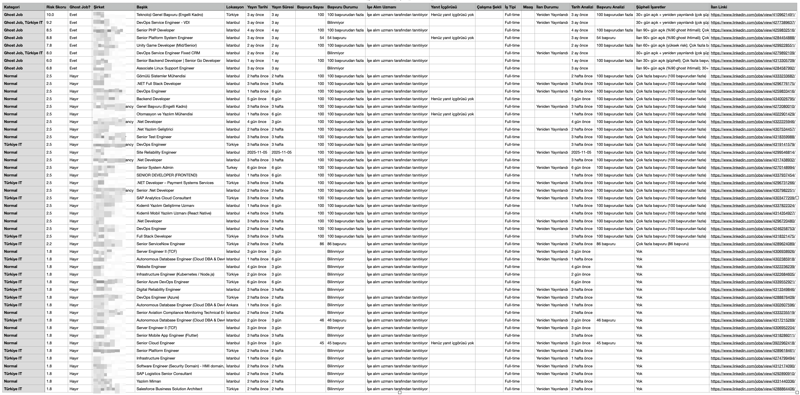

# LinkedIn Ghost Job Analyzer


LinkedIn iş ilanlarını analiz ederek "ghost job" (hayalet iş) olabilecek ilanları tespit eden otomatik analiz aracı.

---

## ⚠️ Önemli Uyarı ve Yasal Bildirim

### Eğitim Amaçlı Kullanım

**Bu uygulama tamamen eğitim ve araştırma amaçlı geliştirilmiştir.** Uygulama, web scraping, veri analizi ve makine öğrenmesi tekniklerini öğrenmek ve LinkedIn iş ilanları üzerinde akademik/araştırma amaçlı analiz yapmak için tasarlanmıştır.

### Analiz Sonuçları Hakkında

Bu uygulama tarafından üretilen analiz sonuçları ve "ghost job" tespitleri:

- **Otomatik algoritmalar** tarafından hesaplanan **risk skorlarına** dayanmaktadır
- **Kesin bir gerçeklik** değil, **olasılık bazlı değerlendirmelerdir**
- **Yanlış pozitif (false positive)** sonuçlar içerebilir
- **Şirketlerin gerçek işe alım niyetlerini** doğrudan kanıtlamaz veya çürütmez

**Not**: Bu uygulama, şirketleri suçlamak veya kötülemek amacıyla değil, **işe alım süreçlerindeki şeffaflığı artırmak** ve **adayların zamanlarını korumak** için geliştirilmiştir. Meşru işe alım yapan şirketler, bu analiz sonuçlarını kendi süreçlerini iyileştirmek için bir fırsat olarak görebilirler.

---

## 🚀 Son Güncellemeler (v2.0)

### ✨ Yeni Özellikler

- **📄 Çok Sayfalı Tarama**: Artık tüm sayfalardaki ilanları otomatik olarak toplar (pagination desteği)
- **🔍 Gelişmiş İlan Toplama**: Daha fazla ilan bulmak için geliştirilmiş scroll ve extraction algoritması
- **⚡ Performans İyileştirmeleri**: Daha hızlı veri çıkarma ve analiz
- **🎯 Akıllı Pagination**: "Sayfa 1/9" gibi pagination bilgilerini otomatik tespit eder ve tüm sayfalarda gezinir
- **📊 Kapsamlı Veri Çıkarma**: Her ilan için 15+ farklı veri noktası toplanır

### 🐛 Düzeltmeler

- Pagination tespiti ve navigasyon sorunları çözüldü
- İlan toplama algoritması optimize edildi
- False positive oranı azaltıldı (yeni ilanlar için daha az agresif puanlama)
- Session yönetimi iyileştirildi

---

## 🎯 Uygulamanın Amacı ve Çalışma Şekli



### Amaç

Bu uygulama, LinkedIn'deki iş ilanlarını analiz ederek şüpheli veya "ghost job" olabilecek ilanları tespit eder. Ghost job'lar, şirketlerin gerçekten işe alım yapmak yerine:

- **Veri toplama amaçlı** açılan ilanlar
- **Uzun süredir açık** kalan ve hiç kapanmayan ilanlar
- **Çok fazla başvuru** alan ama hiç işe alım yapılmayan ilanlar
- **Şirket marka bilinirliği** için açılan ilanlar
- **Yeniden yayınlanan** eski ilanlar

### Çalışma Şekli

Uygulama 5 ana adımda çalışır:

1. **🔐 Otomatik Giriş**: LinkedIn'e email/parola ile otomatik giriş yapar
2. **🔍 İlan Toplama**: Belirtilen LinkedIn sayfasından iş ilanlarını toplar
3. **📄 Sayfa Gezinme**: Tüm sayfalarda (pagination) gezinerek belirtilen sayıda ilan toplar
4. **📊 Detay Çıkarma**: Her ilanın detay sayfasına gidip kapsamlı bilgileri çıkarır
5. **🎯 Analiz ve Raporlama**: Toplanan verileri analiz eder, risk skorları hesaplar ve CSV/JSON raporları oluşturur

[](https://asciinema.org/a/qeYdiAxsft8160c66mAc40Cjc)


### Toplanan Veriler

Her iş ilanı için şu bilgiler toplanır:

- **Başlık** (Title)
- **Şirket** (Company)
- **Lokasyon** (Location)
- **Yayın Tarihi** (Posted Date)
- **Yayın Süresi** (Duration)
- **Başvuru Sayısı** (Applicants)
- **Başvuru Durumu** (Applicant Status)
- **İşe Alım Uzmanı** (Recruiter Info)
- **Yanıt İçgörüsü** (Response Insight)
- **Çalışma Şekli** (Work Type: Remote, Hybrid, On-site)
- **İş Tipi** (Employment Type: Full-time, Part-time, Contract)
- **Maaş** (Salary - varsa)
- **İlan Durumu** (Posting Status: Yeniden Yayınlandı, Genel Başvuru vb.)
- **İlan Linki** (Job Link)

---

## 📊 Puanlama Mantığı

Uygulama, her ilan için **0-10 arası** bir risk skoru hesaplar. Bu skor, 7 ana kriterden oluşur:

### 1. Yayın Tarihi ve Süresi (0-2 puan)

- **90+ gün açık**: 2.0 puan (%90 ghost ihtimali)
- **60-90 gün açık**: 1.5 puan (Yüksek risk)
- **30-60 gün açık**: 1.0 puan (Şüpheli)
- **30 günden az**: 0 puan (Normal)
- **Tarih bilgisi yok**: 1.5 puan

**Özel Kural**: İlan **30+ gün açıksa VE yeniden yayınlandıysa** → **+3.0 ek puan** (çok şüpheli)

### 2. İlan Açıklama Kalitesi (0-2.5 puan)

- **Açıklama yok veya çok kısa (<200 karakter)**: 2.5 puan
- **Kısa açıklama (200-500 karakter)**: 1.5 puan
- **Belirsiz/genel ifadeler** (3+ adet): 2.0 puan
- **Belirsiz ifadeler** (1-2 adet): 1.0 puan
- **Aşırı geniş görev tanımı** (teknik+idari+müşteri ilişkileri): +2 puan
- **Başlık-görev tanımı tutarsızlığı**: +1 puan

**Belirsiz İfadeler**: "dinamik ekip", "çeşitli görevler", "her şeyi yapabilen", "genel", "various", "multiple" vb.

### 3. Maaş Şeffaflığı (0-2 puan)

- **Maaş bilgisi yok** (30+ gün açık ilanlarda): 2.0 puan
- **Maaş bilgisi yok** (30 günden az açık ilanlarda): 0.5 puan
- **Belirsiz maaş** ("rekabetçi maaş", "görüşülür" vb.): 1.0 puan (30+ gün açık), 0.5 puan (yeni ilan)

### 4. Yüksek Başvuru Sayısı Ama Hareketsizlik (0-1.5 puan)

- **100+ başvuru + yanıt içgörüsü yok** (30+ gün açık ilanlarda): 1.5 puan
- **100+ başvuru + yanıt var** (30+ gün açık ilanlarda): 0.5 puan
- **30 günden az açık ilanlarda**: Bu kriter uygulanmaz (false positive önlemek için)

### 5. Yanıt Alamama / İletişim Gecikmesi (0-1 puan)

- **14+ gün açık + yanıt içgörüsü yok** (30+ gün açık ilanlarda): 1.0 puan
- **30 günden az açık ilanlarda**: Bu kriter uygulanmaz

### 6. Gereksinim Anomalileri (0-1 puan)

- **Junior pozisyon ama senior deneyim bekleniyor**: 1.0 puan
- **Gerçekçi olmayan yıl deneyimi** (junior için 5+ yıl): 1.0 puan

### 7. İlan Durumu (0-1.5 puan)

- **30+ gün açık + Yeniden Yayınlandı**: 2.0 puan (yukarıda zaten +3.0 eklenmiş)
- **30+ gün açık + Genel Başvuru**: 1.5 puan
- **Yeni ilan + Genel Başvuru**: 0.5 puan
- **30+ gün açık + Tekrarlanan Yayın**: 1.0 puan

### False Positive Önleme

Yeni ilanlar (30 günden az açık) için daha az agresif puanlama:

- **30 günden az açık ilanlar için eşik**: 4 puan (Ghost Job olarak işaretlenmek için)
- **30+ gün açık ilanlar için eşik**: 3 puan (Ghost Job olarak işaretlenmek için)
- **Yeni ilanlarda bazı kriterler uygulanmaz** (yüksek başvuru + hareketsizlik, iletişim gecikmesi vb.)

### Final Skor Hesaplama

```
Final Skor = (Normalize Edilmiş Risk Skoru + Detaylı Skor) / 2
```

- **Normalize Edilmiş Risk Skoru**: Eski puanlama sisteminden normalize edilmiş (0-10)
- **Detaylı Skor**: Yeni 7 kriterli puanlama sistemi (0-10)
- **Final Skor**: İki skorun ortalaması (0-10 arası)

### Ghost Job Eşiği

- **30+ gün açık ilanlar**: Risk skoru ≥ 3 → Ghost Job
- **30 günden az açık ilanlar**: Risk skoru ≥ 4 → Ghost Job

---

## 🛠️ Kullanılan Teknolojiler

Bu proje aşağıdaki teknolojiler ve kütüphaneler kullanılarak geliştirilmiştir:

### Backend & Automation
- **Python 3.7+** - Ana programlama dili
- **Selenium WebDriver 4.0+** - Web tarayıcı otomasyonu
- **WebDriver Manager** - ChromeDriver otomatik yönetimi
- **Chrome/Chromium** - Tarayıcı motoru

### Data Processing
- **JSON** - Veri saklama ve işleme formatı
- **CSV** - Rapor oluşturma formatı
- **Regular Expressions (re)** - Metin işleme ve parsing

### Web Technologies
- **JavaScript** - Browser console extractor (`collections_extractor.js`)
- **HTML/CSS Selectors** - Web scraping için element seçimi
- **XPath** - Gelişmiş element lokasyon stratejisi

### Features
- **Browser Automation** - Otomatik sayfa gezinme ve etkileşim
- **Web Scraping** - LinkedIn'den veri çıkarma
- **Session Management** - Oturum yönetimi ve cookie işleme
- **Data Analysis** - Risk skorlama ve ghost job tespiti
- **Report Generation** - CSV/JSON rapor oluşturma

### Development Tools
- **Virtual Environment (venv)** - Bağımlılık yönetimi
- **pip** - Paket yönetimi

---

## 🚀 Kurulum

### Gereksinimler

- **Python 3.7 veya üzeri**
- **Google Chrome** veya **Chromium** tarayıcı
- **ChromeDriver** (otomatik yüklenir - webdriver-manager ile)
- **İnternet bağlantısı**

### macOS Kurulumu

#### Adım 1: Python Kurulumunu Kontrol Edin

```bash
python3 --version
```

Eğer Python yüklü değilse:

```bash
# Homebrew ile Python yükleyin
brew install python3
```

#### Adım 2: Proje Dizinine Gidin

```bash
cd "/path/to/Linkedin"
```

#### Adım 3: Virtual Environment Oluşturun

```bash
python3 -m venv venv
```

#### Adım 4: Virtual Environment'ı Aktif Edin

```bash
source venv/bin/activate
```

Terminal'de `(venv)` yazısı görünmelidir.

#### Adım 5: Gerekli Paketleri Yükleyin

```bash
pip install --upgrade pip
pip install -r requirements.txt
```

#### Adım 6: Chrome Kurulumunu Kontrol Edin

```bash
ls "/Applications/Google Chrome.app"
```

Eğer yüklü değilse, [Chrome'u indirip yükleyin](https://www.google.com/chrome/).

#### ✅ macOS Kurulumu Tamamlandı!

---

### Windows Kurulumu

#### Adım 1: Python Kurulumunu Kontrol Edin

**PowerShell** veya **Command Prompt**'u açın:

```cmd
python --version
```

veya

```cmd
py --version
```

Eğer Python yüklü değilse:

1. [Python.org](https://www.python.org/downloads/) adresinden Python 3.7+ indirin
2. İndirilen `.exe` dosyasını çalıştırın
3. **"Add Python to PATH"** seçeneğini işaretleyin
4. **"Install Now"** butonuna tıklayın

#### Adım 2: Proje Dizinine Gidin

```cmd
cd "C:\Users\KullaniciAdi\Desktop\Makale_Video\Super Mario-New\exam\Linkedin"
```

**Not:** Dizin yolunu kendi sisteminize göre değiştirin.

#### Adım 3: Virtual Environment Oluşturun

```cmd
python -m venv venv
```

veya

```cmd
py -m venv venv
```

#### Adım 4: Virtual Environment'ı Aktif Edin

**PowerShell'de:**
```powershell
.\venv\Scripts\Activate.ps1
```

Eğer execution policy hatası alırsanız:
```powershell
Set-ExecutionPolicy -ExecutionPolicy RemoteSigned -Scope CurrentUser
```

**Command Prompt'ta:**
```cmd
venv\Scripts\activate.bat
```

Terminal'de `(venv)` yazısı görünmelidir.

#### Adım 5: Gerekli Paketleri Yükleyin

```cmd
python -m pip install --upgrade pip
pip install -r requirements.txt
```

#### Adım 6: Chrome Kurulumunu Kontrol Edin

Chrome'un yüklü olduğundan emin olun. Eğer yüklü değilse, [Chrome'u indirip yükleyin](https://www.google.com/chrome/).

#### ✅ Windows Kurulumu Tamamlandı!

---

## 📖 Kullanım

### Komut Formatı

```bash
python3 auto_analyzer.py "LINKEDIN_URL" "EMAIL" "PASSWORD" [MAX_JOBS]
```

### Parametreler

| Parametre | Zorunlu | Açıklama | Örnek |
|-----------|---------|----------|-------|
| `LINKEDIN_URL` | ✅ Evet | LinkedIn iş ilanları sayfasının URL'si | `https://www.linkedin.com/jobs/search/?keywords=IT` |
| `EMAIL` | ❌ Hayır | LinkedIn email adresiniz | `kullanici@email.com` |
| `PASSWORD` | ❌ Hayır | LinkedIn parolanız | `sifre123` |
| `MAX_JOBS` | ❌ Hayır | Taranacak maksimum ilan sayısı (varsayılan: 30) | `50` |

### Örnek Kullanımlar

#### Örnek 1: 50 İlan İçin (Tüm Parametrelerle)

**macOS/Linux:**
```bash
cd "/path/to/Linkedin"
source venv/bin/activate
python3 auto_analyzer.py "https://www.linkedin.com/jobs/search/?keywords=IT&location=Turkey" "kullanici@email.com" "sifre123" 50
```

**Windows:**
```cmd
cd "C:\path\to\Linkedin"
venv\Scripts\activate
python auto_analyzer.py "https://www.linkedin.com/jobs/search/?keywords=IT&location=Turkey" "kullanici@email.com" "sifre123" 50
```

#### Örnek 2: Sadece URL (Email/Parola script içinde tanımlıysa ve 30 İlan)

```bash
python3 auto_analyzer.py "https://www.linkedin.com/jobs/search/?keywords=IT&location=Turkey"
```

#### Örnek 3: URL ve Email (Parola script içinde tanımlıysa ve 30 İlan)

```bash
python3 auto_analyzer.py "https://www.linkedin.com/jobs/search/?keywords=IT&location=Turkey" "kullanici@email.com"
```

#### Örnek 4: 100 İlan İçin

```bash
python3 auto_analyzer.py "URL" "EMAIL" "PASSWORD" 100
```

### Güvenli Parola Kullanımı

Parolanızı komut satırında görünür şekilde girmek güvenli değildir. Bunun yerine:

1. `auto_analyzer.py` dosyasını açın
2. `main()` fonksiyonunda şu satırları bulun:

```python
# Varsayılan email/şifre
if not email:
    email = 'your_email@example.com'  # Buraya email'inizi yazın
if not password:
    password = 'your_password'  # Buraya parolanızı yazın
```

3. Değerleri değiştirin ve dosyayı kaydedin
4. Script'i sadece URL ile çalıştırın:

```bash
python3 auto_analyzer.py "LINKEDIN_URL" "" "" 50
```

**⚠️ Önemli:** `auto_analyzer.py` dosyasını Git'e commit etmeyin veya paylaşmayın!

### İşlem Adımları

Script çalıştırıldığında şu adımlar otomatik olarak gerçekleşir:

1. **🔐 ADIM 1: LinkedIn'e Giriş Yapılıyor...**
   - Chrome tarayıcı açılır
   - LinkedIn login sayfasına gidilir
   - Email ve parola girilir
   - Giriş yapılır

2. **🔍 ADIM 2: İş İlanları Çıkarılıyor...**
   - Belirtilen LinkedIn iş ilanları sayfasına gidilir
   - Maksimum ilan sayısı belirtilir

3. **🔍 ADIM 3: İlanlar Toplanıyor (Tüm Sayfalar)...**
   - Pagination bilgisi tespit edilir (örn: "Sayfa 1/9")
   - Her sayfada sayfa kaydırılarak tüm iş ilanları toplanır
   - JavaScript extractor ve manuel yöntemlerle job ID'leri toplanır
   - Belirtilen sayıda ilan toplanana kadar tüm sayfalarda gezinilir
   - Eğer 0 ilan bulunursa, manuel arama yapılır

4. **🔍 ADIM 4: İlan Detaylarına Gidiliyor...**
   - Her ilanın detay sayfasına gidilir (maksimum MAX_JOBS kadar)
   - Başlık, şirket, lokasyon, tarih, başvuru sayısı vb. bilgiler çıkarılır
   - İlan durumu (Yeniden Yayınlandı, Genel Başvuru vb.) tespit edilir

5. **📊 Ghost Job Analizi Başlatılıyor...**
   - Toplanan ilanlar analiz edilir
   - Risk skorları hesaplanır (0-10 arası)
   - Ghost job'lar tespit edilir

6. **📁 Rapor Oluşturuluyor...**
   - CSV raporu `report/` dizinine kaydedilir
   - JSON raporları `report/` dizinine kaydedilir

### Çıktı Dosyaları

Script çalıştıktan sonra `report/` dizininde şu dosyalar oluşturulur:

- **`linkedin_jobs_master_report_YYYYMMDD_HHMMSS.csv`**: Tüm ilanların detaylı analizi (Ana rapor)
- **`all_jobs_analysis_YYYYMMDD_HHMMSS.json`**: Tüm ilanların JSON formatında analizi
- **`ghost_jobs_report_YYYYMMDD_HHMMSS.json`**: Şüpheli ilanların JSON formatında analizi

### CSV Raporu Sütunları

| Sütun | Açıklama | Örnek |
|-------|----------|-------|
| Kategori | İlan kategorisi | `Ghost Job`, `Normal`, `Türkiye IT` |
| Risk Skoru | 0-10 arası risk skoru | `4.5`, `9.0`, `2.0` |
| Ghost Job? | Ghost job mu? | `Evet`, `Hayır` |
| Şirket | Şirket adı | `IKEA`, `Amazon` |
| Başlık | İş başlığı | `Software Engineer` |
| Lokasyon | İş lokasyonu | `İstanbul`, `Remote` |
| Yayın Tarihi | İlan yayın tarihi | `2025-11-12`, `3 gün önce` |
| Yayın Süresi | İlan ne kadar süredir açık | `3 gün`, `1 hafta`, `3 ay` |
| Başvuru Sayısı | Kaç kişi başvurmuş | `52`, `100` |
| Başvuru Durumu | Başvuru durumu | `52 başvuru`, `100 başvurudan fazla` |
| İşe Alım Uzmanı | İşe alım uzmanı bilgisi | `İşe alım uzmanı tarafından tanıtılıyor` |
| Yanıt İçgörüsü | Yanıt içgörüsü bilgisi | `Henüz yanıt içgörüsü yok` |
| Çalışma Şekli | Çalışma şekli | `Remote`, `Hybrid`, `On-site` |
| İş Tipi | İş tipi | `Full-time`, `Part-time`, `Contract` |
| Maaş | Maaş bilgisi (varsa) | `$100,000/year` |
| İlan Durumu | İlan durumu | `Yeniden Yayınlandı`, `Genel Başvuru` |
| Tarih Analizi | Tarih analizi sonucu | `3 gün önce` |
| Başvuru Analizi | Başvuru analizi sonucu | `100 başvurudan fazla` |
| Şüpheli İşaretler | Şüpheli işaretler | `Çok fazla başvuru; Genel lokasyon` |
| İlan Linki | İlanın LinkedIn linki | `https://www.linkedin.com/jobs/view/123456/` |

### Risk Skoru Yorumlama

- **0-2**: Düşük risk, normal ilan
- **3-5**: Orta risk, şüpheli ilan (30+ gün açık ilanlarda Ghost Job olarak işaretlenir)
- **4-5**: Orta risk, şüpheli ilan (30 günden az açık ilanlarda Ghost Job olarak işaretlenir)
- **6-8**: Yüksek risk, çok şüpheli ilan
- **9-10**: Çok yüksek risk, kesinlikle ghost job

---

## 🔧 Sorun Giderme

### Problem: "Chrome driver başlatılamadı"

**Çözüm:**

**macOS:**
```bash
# ChromeDriver otomatik yüklenir (webdriver-manager ile)
# Manuel yükleme gerekirse:
brew install chromedriver
```

**Windows:**
- ChromeDriver otomatik yüklenir
- Eğer sorun devam ederse, Chrome'un güncel olduğundan emin olun

### Problem: "Hiç ilan bulunamadı"

**Çözüm:**
1. LinkedIn sayfasının doğru yüklendiğinden emin olun
2. Sayfayı manuel olarak aşağı kaydırın
3. "Sign in to view more jobs" mesajı varsa, script otomatik olarak giriş yapacaktır
4. Script'i tekrar çalıştırın

### Problem: "Login başarısız"

**Çözüm:**
1. Email ve parolanın doğru olduğundan emin olun
2. LinkedIn'de 2FA (iki faktörlü doğrulama) aktifse, geçici olarak devre dışı bırakın
3. LinkedIn'de CAPTCHA çıkarsa, manuel olarak çözün
4. LinkedIn hesabınızın kilitli olmadığından emin olun

### Problem: "ModuleNotFoundError: No module named 'selenium'"

**Çözüm:**
```bash
# Virtual environment'ın aktif olduğundan emin olun
source venv/bin/activate  # macOS/Linux
# veya
venv\Scripts\activate     # Windows

# Paketleri tekrar yükleyin
pip install -r requirements.txt
```

---

## ⚠️ Önemli Notlar ve Güvenlik

### 🔒 Güvenlik Uyarıları

1. **Parola Güvenliği**: 
   - Parolanızı komut satırında görünür şekilde girmek güvenli değildir
   - Mümkünse parolayı script içinde ayarlayın
   - `token.txt` dosyasını asla paylaşmayın (session bilgileriniz içerir)

2. **Session Süresi**: 
   - LinkedIn session'ları genellikle 24 saat geçerlidir
   - Session süresi dolduğunda tekrar giriş yapmanız gerekir

3. **Rate Limiting**: 
   - Çok fazla istek LinkedIn tarafından engellenebilir
   - Script her ilan arasında kısa bir bekleme yapar (rate limiting'i önlemek için)

4. **CAPTCHA ve 2FA**: 
   - LinkedIn bazen CAPTCHA veya 2FA isteyebilir
   - Bu durumda manuel olarak müdahale etmeniz gerekebilir

### 📝 Kullanım İpuçları

1. **İlan Sayısı**: Script varsayılan olarak ilk 30 ilanı çıkarır. Daha fazla ilan için komut satırına 4. parametre olarak sayıyı ekleyin (örn: `50`).

2. **Hız Optimizasyonu**: Script, her ilanın detay sayfasına gitmeden önce mevcut bilgileri kontrol eder. Eğer bilgiler mevcutsa, detay sayfasına gitmez (daha hızlı).

3. **Rapor Formatı**: CSV raporları Excel, Google Sheets veya herhangi bir spreadsheet uygulaması ile açılabilir.

---

## 📁 Dosya Yapısı

```
Linkedin/
├── auto_analyzer.py            # Otomatik extraction ve analiz (Ana script)
├── linkedin_analyzer.py        # Analiz ve raporlama scripti
├── collections_extractor.js  # Browser console extractor (JavaScript)
├── requirements.txt            # Python bağımlılıkları
├── README.md                   # Bu dosya (Kullanım kılavuzu)
├── run.sh                      # Mac/Linux çalıştırma scripti
├── run.bat                     # Windows çalıştırma scripti
├── token.txt                   # Session bilgileri (opsiyonel, fallback login için)
├── venv/                       # Virtual environment (Python bağımlılıkları)
└── report/                     # Oluşturulan raporlar (otomatik oluşturulur)
    ├── linkedin_jobs_master_report_YYYYMMDD_HHMMSS.csv  # Ana CSV raporu
    ├── all_jobs_analysis_YYYYMMDD_HHMMSS.json           # Tüm ilanların JSON analizi
    └── ghost_jobs_report_YYYYMMDD_HHMMSS.json            # Şüpheli ilanların JSON analizi
```

### Dosya Açıklamaları

- **`auto_analyzer.py`**: Ana script. LinkedIn'e giriş yapar, ilanları toplar, detayları çıkarır ve analiz eder.
- **`linkedin_analyzer.py`**: Ghost job analizi yapar, risk skorları hesaplar ve raporlar oluşturur.
- **`collections_extractor.js`**: Browser console'da çalıştırılan JavaScript kodu. İlk job ID'leri toplar.
- **`requirements.txt`**: Python paket bağımlılıkları (selenium, webdriver-manager).
- **`token.txt`**: LinkedIn session bilgileri (li_at cookie). Email/şifre yoksa kullanılır.
- **`jobs.json`**: Script çalışırken otomatik oluşturulan geçici dosya. İlan verilerini içerir.
- **`report/`**: Tüm raporlar bu dizinde oluşturulur. Her çalıştırmada yeni timestamp'li dosyalar oluşur.

---

## 🏗️ Sistem Mimarisi

Aşağıda scriptin çalışma mimarisi ve veri akışı gösterilmektedir:

```
┌─────────────────────────────────────────────────────────────────────────┐
│                         LinkedIn Ghost Job Analyzer                      │
│                              auto_analyzer.py                            │
└─────────────────────────────────────────────────────────────────────────┘
                                    │
                                    ▼
┌─────────────────────────────────────────────────────────────────────────┐
│                          1. BAŞLATMA (main())                            │
│  ┌──────────────────────────────────────────────────────────────────┐  │
│  │ • Komut satırı parametrelerini parse et (URL, email, password)   │  │
│  │ • LinkedInAutoExtractor instance oluştur                         │  │
│  │ • max_jobs değerini ayarla (varsayılan: 30)                      │  │
│  └──────────────────────────────────────────────────────────────────┘  │
└─────────────────────────────────────────────────────────────────────────┘
                                    │
                                    ▼
┌─────────────────────────────────────────────────────────────────────────┐
│                   2. DRIVER KURULUMU (setup_driver())                    │
│  ┌──────────────────────────────────────────────────────────────────┐  │
│  │ • Chrome Options yapılandır                                      │  │
│  │ • WebDriver Manager ile ChromeDriver yükle                      │  │
│  │ • Chrome tarayıcı instance'ı oluştur                           │  │
│  └──────────────────────────────────────────────────────────────────┘  │
└─────────────────────────────────────────────────────────────────────────┘
                                    │
                                    ▼
┌─────────────────────────────────────────────────────────────────────────┐
│                   3. GİRİŞ YAPMA (login_with_credentials())             │
│  ┌──────────────────────────────────────────────────────────────────┐  │
│  │  ┌──────────────────────────────────────────────────────────┐  │  │
│  │  │ Email/Password Varsa:                                    │  │  │
│  │  │ • LinkedIn login sayfasına git                           │  │  │
│  │  │ • Email input alanını bul ve doldur                      │  │  │
│  │  │ • Password input alanını bul ve doldur                    │  │  │
│  │  │ • Sign in butonuna tıkla                                 │  │  │
│  │  │ • Giriş başarısını kontrol et                            │  │  │
│  │  └──────────────────────────────────────────────────────────┘  │  │
│  │  ┌──────────────────────────────────────────────────────────┐  │  │
│  │  │ Token Varsa (token.txt):                                  │  │  │
│  │  │ • Session cookie'lerini yükle (li_at)                   │  │  │
│  │  │ • Cookie'leri tarayıcıya ekle                             │  │  │
│  │  │ • Ana sayfaya git ve login kontrolü yap                   │  │  │
│  │  └──────────────────────────────────────────────────────────┘  │  │
│  └──────────────────────────────────────────────────────────────────┘  │
└─────────────────────────────────────────────────────────────────────────┘
                                    │
                                    ▼
┌─────────────────────────────────────────────────────────────────────────┐
│             4. İLAN TOPLAMA (extract_jobs()) - ANA DÖNGÜ                 │
│  ┌──────────────────────────────────────────────────────────────────┐  │
│  │ 4.1. Hedef URL'ye Git                                            │  │
│  │      • LinkedIn iş ilanları sayfasına navigate                  │  │
│  │      • Sayfa yüklenmesini bekle                                 │  │
│  │                                                                   │  │
│  │ 4.2. Pagination Tespiti                                          │  │
│  │      • "Sayfa 1/9" formatını ara (.jobs-search-pagination)       │  │
│  │      • Toplam sayfa sayısını çıkar (regex ile)                   │  │
│  │      • current_page = 1, total_pages = N                        │  │
│  │                                                                   │  │
│  │ 4.3. Sayfa Döngüsü (while page <= total_pages)                  │  │
│  │      ┌─────────────────────────────────────────────────────┐   │  │
│  │      │ Her Sayfa İçin:                                      │   │  │
│  │      │                                                       │   │  │
│  │      │ a) Sayfa Scroll İşlemi:                              │   │  │
│  │      │    • 5 kez kademeli scroll (lazy loading için)        │   │  │
│  │      │    • En alta scroll, sonra yukarı, tekrar aşağı       │   │  │
│  │      │                                                       │   │  │
│  │      │ b) Job ID Toplama:                                     │   │  │
│  │      │    ┌─────────────────────────────────────────────┐  │   │  │
│  │      │    │ Yöntem 1: JavaScript Extractor              │  │   │  │
│  │      │    │ • collections_extractor.js çalıştır         │  │   │  │
│  │      │    │ • execute_async_script() ile inject et       │  │   │  │
│  │      │    │ • window.linkedinJobs array'ini al           │  │   │  │
│  │      │    └─────────────────────────────────────────────┘  │   │  │
│  │      │    ┌─────────────────────────────────────────────┐  │   │  │
│  │      │    │ Yöntem 2: Manuel Extraction (Fallback)       │  │   │  │
│  │      │    │ • a[href*='/jobs/view/'] selector'ları       │  │   │  │
│  │      │    │ • page_source'da regex ile /jobs/view/(\d+) │  │   │  │
│  │      │    │ • Tüm <a> tag'lerinden href çıkar            │  │   │  │
│  │      │    └─────────────────────────────────────────────┘  │   │  │
│  │      │                                                       │   │  │
│  │      │ c) Unique Job ID'leri Topla:                         │   │  │
│  │      │    • all_job_ids set'ine ekle (duplicate önleme)     │   │  │
│  │      │    • Hedef sayıya ulaşıldı mı kontrol et             │   │  │
│  │      │                                                       │   │  │
│  │      │ d) Sonraki Sayfaya Geç:                             │   │  │
│  │      │    • "Sonraki sayfayı görüntüle" butonunu bul        │   │  │
│  │      │    • VEYA sayfa numarası butonuna tıkla (3. Sayfa)   │   │  │
│  │      │    • VEYA URL'yi değiştir (?start=25)                │   │  │
│  │      │    • Yeni sayfanın yüklenmesini bekle                │   │  │
│  │      └─────────────────────────────────────────────────────┘   │  │
│  │                                                                   │  │
│  │ 4.4. İlan Detay Çıkarma Döngüsü (Her Job ID İçin)               │  │
│  │      ┌─────────────────────────────────────────────────────┐   │  │
│  │      │ Her İlan İçin:                                       │   │  │
│  │      │                                                       │   │  │
│  │      │ a) Detay Sayfasına Git:                              │   │  │
│  │      │    • https://www.linkedin.com/jobs/view/{job_id}/    │   │  │
│  │      │    • Sayfa yüklenmesini bekle                        │   │  │
│  │      │    • Login gerekiyorsa tekrar giriş yap                │   │  │
│  │      │                                                       │   │  │
│  │      │ b) Veri Çıkarma (15+ Farklı Selector):                │   │  │
│  │      │    • Başlık: h1.job-title, h1[class*='job-title']     │   │  │
│  │      │    • Şirket: a[data-tracking-control-name='org-name'] │   │  │
│  │      │    • Lokasyon: .jobs-details-top-card__bullet          │   │  │
│  │      │    • Tarih: time[datetime], .jobs-details-top-card    │   │  │
│  │      │    • Başvuru: .jobs-details-top-card__job-info-text   │   │  │
│  │      │    • İşe Alım: //*[contains(text(), 'tanıtılıyor')]   │   │  │
│  │      │    • Yanıt İçgörüsü: //*[contains(text(), 'yanıt')]  │   │  │
│  │      │    • Çalışma Şekli: Remote/Hybrid/On-site regex       │   │  │
│  │      │    • İş Tipi: Full-time/Part-time regex              │   │  │
│  │      │    • Maaş: [class*='salary'] selector                │   │  │
│  │      │    • İlan Durumu: "Yeniden Yayınlandı" tespiti       │   │  │
│  │      │                                                       │   │  │
│  │      │ c) Job Dictionary Oluştur:                            │   │  │
│  │      │    {                                                  │   │  │
│  │      │      'link': 'https://...',                          │   │  │
│  │      │      'title': 'Software Engineer',                    │   │  │
│  │      │      'company': 'Tech Corp',                          │   │  │
│  │      │      'location': 'Istanbul',                         │   │  │
│  │      │      'posted_date': '2025-11-17',                    │   │  │
│  │      │      'applicants': '100 başvurudan fazla',           │   │  │
│  │      │      ... (15+ alan)                                   │   │  │
│  │      │    }                                                  │   │  │
│  │      └─────────────────────────────────────────────────────┘   │  │
│  └──────────────────────────────────────────────────────────────────┘  │
└─────────────────────────────────────────────────────────────────────────┘
                                    │
                                    ▼
┌─────────────────────────────────────────────────────────────────────────┐
│                   5. VERİ KAYDETME (save_jobs())                         │
│  ┌──────────────────────────────────────────────────────────────────┐  │
│  │ • Tüm job dictionary'lerini JSON formatına çevir                │  │
│  │ • jobs.json dosyasına kaydet                                    │  │
│  │ • Dosya yolu döndür (linkedin_analyzer'a geçir)                 │  │
│  └──────────────────────────────────────────────────────────────────┘  │
└─────────────────────────────────────────────────────────────────────────┘
                                    │
                                    ▼
┌─────────────────────────────────────────────────────────────────────────┐
│             6. GHOST JOB ANALİZİ (linkedin_analyzer.main())              │
│  ┌──────────────────────────────────────────────────────────────────┐  │
│  │ 6.1. JSON Dosyasını Oku                                          │  │
│  │      • jobs.json dosyasını yükle                                 │  │
│  │      • Her ilan için analyze_job() çağır                          │  │
│  │                                                                   │  │
│  │ 6.2. Her İlan İçin Analiz (analyze_job())                        │  │
│  │      ┌─────────────────────────────────────────────────────┐   │  │
│  │      │ a) Tarih Analizi:                                     │   │  │
│  │      │    • parse_job_date() ile gün sayısını hesapla        │   │  │
│  │      │    • 30+ gün açık mı kontrol et                       │   │  │
│  │      │    • Risk puanı: 0-2.0 (90+ gün = 2.0)                │   │  │
│  │      │                                                       │   │  │
│  │      │ b) İlan Açıklama Analizi:                             │   │  │
│  │      │    • analyze_job_description_quality()                │   │  │
│  │      │    • Belirsiz ifadeler sayısı                         │   │  │
│  │      │    • Açıklama uzunluğu                                │   │  │
│  │      │    • Risk puanı: 0-2.5                                 │   │  │
│  │      │                                                       │   │  │
│  │      │ c) Maaş Şeffaflığı:                                    │   │  │
│  │      │    • Maaş bilgisi var mı?                             │   │  │
│  │      │    • Belirsiz maaş ifadeleri                          │   │  │
│  │      │    • Risk puanı: 0-2.0 (30+ gün + maaş yok = 2.0)     │   │  │
│  │      │                                                       │   │  │
│  │      │ d) Başvuru Analizi:                                    │   │  │
│  │      │    • 100+ başvuru + yanıt yok mu? (30+ gün)           │   │  │
│  │      │    • Risk puanı: 0-1.5                                 │   │  │
│  │      │                                                       │   │  │
│  │      │ e) İletişim Gecikmesi:                                 │   │  │
│  │      │    • 14+ gün + yanıt içgörüsü yok mu? (30+ gün)       │   │  │
│  │      │    • Risk puanı: 0-1.0                                 │   │  │
│  │      │                                                       │   │  │
│  │      │ f) Gereksinim Anomalileri:                            │   │  │
│  │      │    • Junior pozisyon + senior deneyim?                 │   │  │
│  │      │    • Risk puanı: 0-1.0                                 │   │  │
│  │      │                                                       │   │  │
│  │      │ g) İlan Durumu:                                        │   │  │
│  │      │    • "Yeniden Yayınlandı" + 30+ gün = +3.0 ek puan    │   │  │
│  │      │    • "Genel Başvuru" = 0.5-1.5 puan                   │   │  │
│  │      │    • Risk puanı: 0-2.5                                 │   │  │
│  │      │                                                       │   │  │
│  │      │ h) Final Skor Hesaplama:                               │   │  │
│  │      │    • Tüm risk puanlarını topla                        │   │  │
│  │      │    • Normalize et (0-10 arası)                         │   │  │
│  │      │    • calculate_detailed_ghost_score() çağır            │   │  │
│  │      │    • Final = (normalized_risk + detailed_score) / 2    │   │  │
│  │      │                                                       │   │  │
│  │      │ i) Ghost Job Tespiti:                                  │   │  │
│  │      │    • 30+ gün açık: risk >= 3 → Ghost Job             │   │  │
│  │      │    • 30 günden az: risk >= 4 → Ghost Job              │   │  │
│  │      └─────────────────────────────────────────────────────┘   │  │
│  │                                                                   │  │
│  │ 6.3. Rapor Oluşturma:                                            │  │
│  │      ┌─────────────────────────────────────────────────────┐   │  │
│  │      │ a) CSV Raporu (create_master_csv_report()):         │   │  │
│  │      │    • Tüm ilanları CSV formatına çevir                │   │  │
│  │      │    • 19 sütun: Kategori, Risk Skoru, Ghost Job?,     │   │  │
│  │      │      Şirket, Başlık, Lokasyon, ...                   │   │  │
│  │      │    • linkedin_jobs_master_report_TIMESTAMP.csv       │   │  │
│  │      │                                                       │   │  │
│  │      │ b) JSON Raporları:                                    │   │  │
│  │      │    • all_jobs_analysis_TIMESTAMP.json                 │   │  │
│  │      │    • ghost_jobs_report_TIMESTAMP.json                 │   │  │
│  │      │                                                       │   │  │
│  │      │ c) Raporları report/ dizinine kaydet                  │   │  │
│  │      └─────────────────────────────────────────────────────┘   │  │
│  └──────────────────────────────────────────────────────────────────┘  │
└─────────────────────────────────────────────────────────────────────────┘
                                    │
                                    ▼
┌─────────────────────────────────────────────────────────────────────────┐
│                   7. TEMİZLİK (close())                                  │
│  ┌──────────────────────────────────────────────────────────────────┐  │
│  │ • WebDriver.quit() ile tarayıcıyı kapat                         │  │
│  │ • Tüm kaynakları serbest bırak                                   │  │
│  └──────────────────────────────────────────────────────────────────┘  │
└─────────────────────────────────────────────────────────────────────────┘
                                    │
                                    ▼
                            ✅ İŞLEM TAMAMLANDI
                         📁 Raporlar report/ dizininde
```

### Bileşenler ve İlişkiler

```
┌──────────────────────┐         ┌──────────────────────┐
│  auto_analyzer.py    │────────▶│ linkedin_analyzer.py │
│  (Ana Script)        │         │  (Analiz Modülü)    │
└──────────────────────┘         └──────────────────────┘
         │                                  │
         │                                  │
         ▼                                  ▼
┌──────────────────────┐         ┌──────────────────────┐
│  Selenium WebDriver   │         │  Risk Skorlama       │
│  (Browser Control)    │         │  Algoritması         │
└──────────────────────┘         └──────────────────────┘
         │                                  │
         │                                  │
         ▼                                  ▼
┌──────────────────────┐         ┌──────────────────────┐
│ collections_extractor │         │  CSV/JSON Report     │
│      .js              │         │  Generator           │
│  (JS Injector)        │         └──────────────────────┘
└──────────────────────┘
```

### Veri Akışı

```
User Input (URL, email, password, max_jobs)
         │
         ▼
┌────────────────┐
│  auto_analyzer  │
│   .main()      │
└────────────────┘
         │
         ▼
┌────────────────┐     ┌──────────────┐     ┌──────────────┐
│  Login Process │────▶│  Job Extract │────▶│  Data Parse  │
└────────────────┘     └──────────────┘     └──────────────┘
         │                     │                     │
         │                     │                     ▼
         │                     │            ┌──────────────┐
         │                     │            │  jobs.json   │
         │                     │            └──────────────┘
         │                     │                     │
         │                     │                     ▼
         │                     │            ┌──────────────┐
         │                     │            │  Analysis     │
         │                     │            │  (Risk Score) │
         │                     │            └──────────────┘
         │                     │                     │
         │                     │                     ▼
         │                     │            ┌──────────────┐
         │                     └───────────▶│  CSV/JSON     │
         │                                  │  Reports      │
         │                                  └──────────────┘
         │
         ▼
    Browser Close
```

---

## 📞 Destek

Sorun yaşarsanız veya önerileriniz varsa:

1. Script çıktısını kontrol edin
2. `report/` dizinindeki log dosyalarını inceleyin
3. README.md dosyasını tekrar okuyun

### İletişim

- **Geliştirici**: Serdar BAYRAM
- **Email**: serdarbayram01@gmail.com
- **Website**: [www.serdarbayram.net](https://www.serdarbayram.net)

---

## 📄 Lisans

Bu proje eğitim amaçlıdır. LinkedIn'in kullanım şartlarına uygun olarak kullanın.

---

**✅ Hazır! Artık LinkedIn'deki ghost job'ları tespit edebilirsiniz!**

---

<div align="center">

**⭐ Bu projeyi beğendiyseniz, GitHub'da star vermeyi unutmayın! ⭐**

---

Made with ❤️ for LinkedIn Job Analysis Community

</div>
